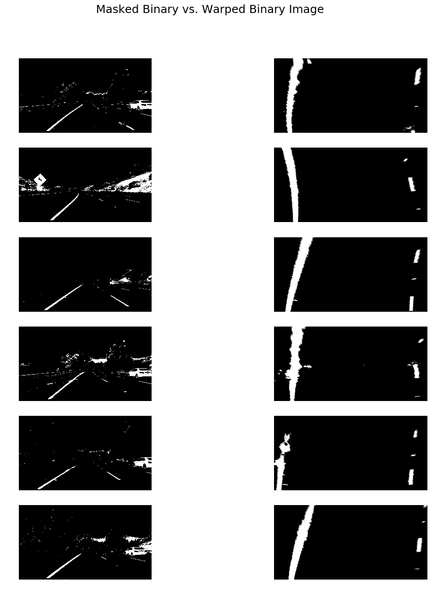
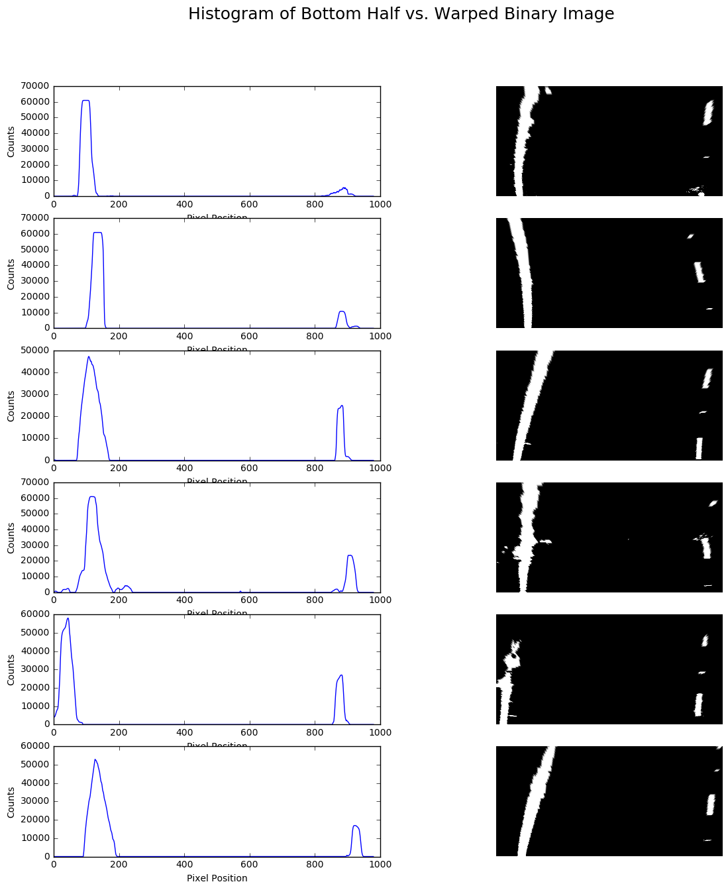
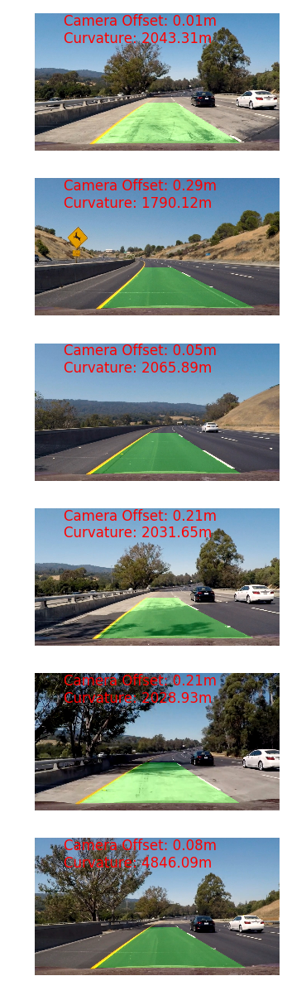

# Advanced Lane Finding
This project is an extension of and more advanced solution to my [first lane finding project](https://github.com/AryanJ-NYC/CarND-LaneLines-P1).
Advanced image analysis techniques are used to find lane lines in an image.  These techniques include camera calibration, distortion correction, image transforms and sliding windows object detection.
A pipeline is created to take in an image of a road (with lane lines) as input and return an image with a highlighted lane and relevant curvature and camera offset calculations.

The steps to the pipeline are as follows:
1. Calibrate the camera.  The [OpenCV tutorial](http://opencv-python-tutroals.readthedocs.io/en/latest/py_tutorials/py_calib3d/py_calibration/py_calibration.html) is helpful with this step.
2. Apply a distortion correction to raw images.
3. Use color transforms to create a thresholded binary image.
4. Mask the pixels of the binary image that are not in directly in front of the camera (which are irrelevant to lane detection).
5. Apply a perspective transform to the binary image to obtain a "bird's eye view" of the lanes.
6. Use the [sliding windows object detection](http://www.pyimagesearch.com/2015/03/23/sliding-windows-for-object-detection-with-python-and-opencv/) technique to identify lane line pixels.
7. Calculate the curvature of the lane and the camera offset with respect to center.
8. Warp the detected lane boundaries back onto the original image.
9. Output visual display of the lane boundaries and numerical estimation of lane curvature and camera offset. 

## Camera Calibration
A set of 20 chessboard images are used to calibrate the camera.  Each image is converted to grayscale then corners were found on each of the 20 images and mapped to a object points.
The OpenCV [`calibrateCamera()`](http://docs.opencv.org/2.4/modules/calib3d/doc/camera_calibration_and_3d_reconstruction.html#calibratecamera) method is used to calculate a camera matrix
(which is used in the next step).  This camera matrix is applied to a chessboard example image and got the following output:  

## Distortion Correction
The camera matrix calculated in the last step is used to undistort each road test image:  

## Color Transform
The RGB, HSV and HSL color spaces are used to identify potential lane pixels.  More specifically, yellow, white and red pixels (within certain RGB, HSV and HSL ranges) are identified.
The code for the color transforms is in the "Create Binary Thresholded Images" code cell.
It uses OpenCV's [`inRange()`](http://docs.opencv.org/2.4/modules/core/doc/operations_on_arrays.html#inrange) method to create an array within a range of specified thresholds.
When the transforms are applied to the test images, the following images are returned:  

## Image Mask
Region masking is applied to each binary image to ignore any pixels outside of the scope of interest.
More specifically, the scope of interest is directly in front of the car's camera.  

## Perspective Transform
A perspective transform is applied to each binary image (and each test image for visualization purposes).
Source and destination points are prepared.  The source points are those around the lane lines (similar to the points used for region masking).
The destination points are calculated with respect to the source points.  Then, OpenCV's [`getPerspectiveTransform()`](http://docs.opencv.org/2.4/modules/imgproc/doc/geometric_transformations.html#getperspectivetransform)
is called to calculate both the transformation matrix and inverse transformation matrix.  Lastly, OpenCV's [`warpPerspective()`](http://docs.opencv.org/2.4/modules/imgproc/doc/geometric_transformations.html#warpperspective)
method is called to generate a perspective transformed image.  

## Sliding Windows Object Detection
A histogram of the pixel counts on the bottom half of the warped image is created.  This histogram is used to find the start of the lane lines:  

A sliding windows approach to object detection is used to find pixels within a specified margin (or window size) of the lane line basepoint.
If many pixels are found, the next window's (the window above the current window) coordinates are recalculated.  Using this technique, the left and right lane lines are identified
(colored in red and blue, respectively).  Please note the thin yellow line in the images which represents the center of each lane:  

## Lane Curvature and Camera Offset Calculations
Lane curvature and camera offset are calculated after detecting and fitting the lane lines.
For this specific project, the curvature is often calculated as extremely high when a rather straight lane line is detected.
An example of this error is seen on the final test image.

## Bird's Eye-View Warped to Original Image
The area between the lane lines is highlighted in green.  The green portion of the image is then warped back onto the original image.
Additionally, the corresponding curvature and camera offset are displayed on the image in red text.  

# Video Output
After using the test images to create and evaluate the pipeline, the entire sample video is run through the pipeline.
The final result can be viewed [here](https://www.youtube.com/watch?v=yhU9O0zttnc) on YouTube.

# Discussion
Overall, I am happy with my pipeline.  As I finished the pipeline, I realized that the image mask was unnecessary
given the perspective transform forces the algorithm to be run on only one part of the image (those pixels which were transformed).
Furthermore, the curvature calculations were incorrect when a straight lane line was fit.  Lastly, a faster algorithm can be created by
running sliding windows only one then only considering those pixels within a given margin of the best-fit lane line.
